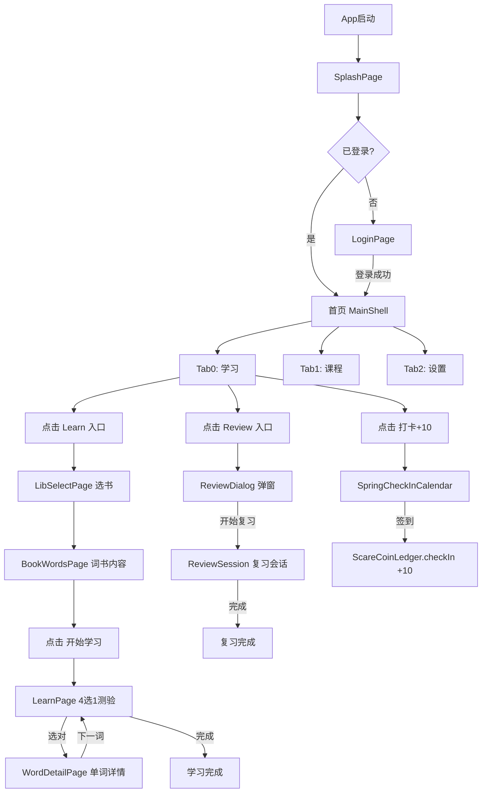
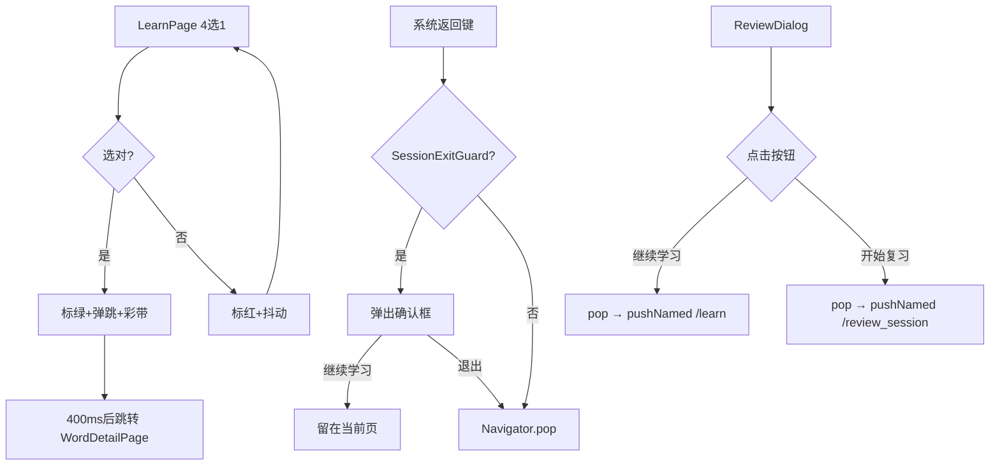
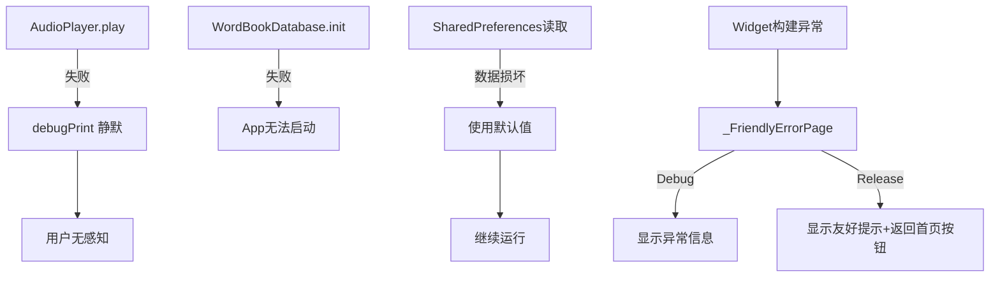

# Monster Word 操作逻辑全面梳理

**日期**: 2026-08-25  
**项目**: Monster Word v2.0.0  
**审查范围**: 全部 screens/ pages/ state/ widgets/ 目录

---

## 一、核心用户流程（Happy Path）

### 1.1 首次启动流程

```
App启动 (main.dart)
  → 初始化数据库 (WordBookDatabase, UserDatabase)
  → 初始化音频会话 (initMobileAudioSession)
  → 显示 SplashPage (splash_page.dart)
    → 播放品牌动画（LiquidLogo + 流星雨 + 波浪文字）
    → 检查登录状态 (LearningState.isLoggedIn)
    → 已登录 → 检查是否首次启动 (hasShownInitGuide)
      → 首次 → 显示引导页 (PageView 3页)
      → 非首次 → pushReplacementNamed('/') → 首页 (MainShell)
    → 未登录 → pushReplacementNamed('/login') → LoginPage
```

**涉及文件：**
- `lib/main.dart:64-104` — 入口初始化
- `lib/pages/splash_page.dart:63-84` — 登录检查逻辑
- `lib/state/learning_state.dart:614-628` — 登录状态

**前置条件：** 无  
**后置状态：** 已登录 → 进入首页；未登录 → 进入登录页

---

### 1.2 登录流程

```
LoginPage (login_page.dart)
  → 主视图：选择登录方式
    → 微信登录 → TODO（显示"开发中"Toast）
    → 手机号登录 → 切换到输入模式 (_loginMode = 2)
      → 输入手机号 + 验证码 → _loginWithPhone()
        → 成功 → pushReplacementNamed('/') → 首页
        → 失败 → SnackBar 提示
    → 账号密码登录 → 切换到输入模式 (_loginMode = 1)
      → 输入用户名/邮箱 + 密码 → _loginWithCoolID()
        → 成功 → pushReplacementNamed('/') → 首页
        → 失败 → SnackBar 提示
    → QQ/微博/华为登录 → TODO（显示"开发中"Toast）
```

**涉及文件：**
- `lib/pages/login_page.dart:66-116` — 登录逻辑
- `lib/state/learning_state.dart:616-628` — 登录 API（TODO 占位）

**前置条件：** 无  
**后置状态：** `LearningState._isLoggedIn = true`，持久化到内存

---

### 1.3 首页导航

```
MainShell (main_shell.dart) — 3个Tab
  → Tab 0 "学习" → HomeScreen (home_screen.dart)
    → 签到卡片（TextRevealCard：点击揭示每日一句）
    → 弹性签到日历入口（右上角"打卡+10"角标）
    → Learn/Review 入口卡（_EntryCard）
    → 每日一句轮播（TestimonialSlider）
    → 下滑查词手势 → SearchPage
    → 右上角单词机入口 → WordMachinePage
    → 左上角查词入口 → SearchPage
  → Tab 1 "课程" → LibSelectPage (lib_select_page.dart)
  → Tab 2 "设置" → ProfileScreen (profile_screen.dart)
```

**涉及文件：**
- `lib/shell/main_shell.dart` — Tab 壳
- `lib/screens/home_screen.dart` — 首页内容
- `lib/main.dart:216-238` — Tab 定义

**状态保持：** `IndexedStack` 保持三个 Tab 状态，切换不 dispose

---

### 1.4 选书 → 学习流程

```
HomeScreen → 点击 "Learn" 入口卡
  → Navigator.pushNamed('/lib_select') → LibSelectPage
    → 显示词书列表（FutureBuilder 加载）
    → 分类Tab：全部/CET4/CET6/高考/考研/雅思/托福/专业出国/其他
    → 点击词书项 → loadBook(book, limit: 50)
      → Navigator.pushNamed('/book_words', arguments: book) → BookWordsPage
        → 显示单词列表（ListWordsPage 基类）
        → 底部 FAB "开始学习"
        → 点击 FAB → Navigator.pushNamed('/learn') → LearnPage
```

**涉及文件：**
- `lib/pages/lib_select_page.dart:440-457` — 选书逻辑
- `lib/state/learning_state.dart:372-396` — loadBook 方法
- `lib/pages/book_words_page.dart:39-43` — 开始学习按钮

**前置条件：** 已登录  
**后置状态：** `_currentBook` 设置，`_queue` 填充单词列表，`_currentIndex = 0`

---

### 1.5 学习流程（4选1测验）

```
LearnPage (learn_page.dart)
  → 顶部导航栏：返回 + 进度 (currentIndex/total) + 收藏星 + 更多
  → 上半区：单词 + 音标 + 发音按钮 + 刮刮乐提示
  → 下半区：4选1 选项
    → 选错：标红 + 抖动动画 → 继续重选
    → 选对：标绿 + 弹跳 + 对勾 + 彩带庆祝
      → 400ms后自动跳转 → Navigator.pushNamed('/word_detail') → WordDetailPage
        → 查看释义/音标/例句/形近词/词根/笔记
        → 点击"下一词" → 返回 LearnPage → 自动下一个单词

学习引擎：LeitnerCardEngine (4选1) + Fsrs6Engine (SRS 记忆曲线)
```

**涉及文件：**
- `lib/pages/learn_page.dart:202-462` — 学习页面逻辑
- `lib/state/learning_state.dart:458-493` — rate() 评分逻辑

**前置条件：** 已选书且 queue 非空  
**后置状态：** 每答一词调用 `rate()` → 更新 FSRS 卡片 → 记录每日统计 → currentIndex++

---

### 1.6 复习流程

```
HomeScreen → 点击 "Review" 入口卡
  → showReviewDialog(context) → 底部弹窗
    → 显示今日已学/今日复习统计 + 进度条
    → 两个按钮：
      → "继续学习" → pop → pushNamed('/learn') → LearnPage
      → "开始复习" → pop → pushNamed('/review_session') → ReviewSession

ReviewSession (review_session.dart)
  → SessionExitGuard 保护（防误触退出）
  → 四选一测验（与学习页类似）
  → 底部三键：认识 / 模糊 / 忘记
    → 评分 → 更新 FSRS 卡片 → 下一词
  → 复习完成 → 显示完成页 → 返回首页
```

**涉及文件：**
- `lib/widgets/review_dialog.dart` — 复习弹窗
- `lib/screens/review_session.dart:100-155` — 复习会话

**前置条件：** 已选书且有复习队列  
**后置状态：** `_dueCount` 减少，FSRS 卡片更新

---

### 1.7 签到 → 奖励流程

```
HomeScreen → 点击 "打卡+10" 角标
  → showModalBottomSheet → SpringCheckInCalendar
    → 显示当月日历（已签到绿色圆点）
    → 点击"签到领10尖叫币"按钮
      → ScareCoinLedger.checkIn()
        → 检查今日是否已签（isSameDay）
        → 未签 → 记入签到日期集合 → 发放+10尖叫币
        → 已签 → 返回 null（不重复签到）
      → 成功 → 弹跳动画 + 连击特效 + "+10👹"浮层
    → 点击月份箭头 → 切换月份（弹性入场动画）

签到历史页：
  → pushNamed('/check_in_history') → CheckInHistoryPage
    → 概览卡片：总天数/连续天数🔥/本月进度环
    → 双月日历：上月半透明 + 当月主视图
    → 签到详情列表（按日期分组）
```

**涉及文件：**
- `lib/pages/scare_coin_history_page.dart:85-99` — checkIn() 逻辑
- `lib/widgets/spring_check_in_calendar.dart` — 签到日历组件
- `lib/pages/check_in_history_page.dart` — 签到历史页

**前置条件：** 已登录  
**后置状态：** `ScareCoinLedger._balance += 10`，`_checkinDates.add(today)`

---

## 二、分支流程

### 2.1 选错重选（学习流程）
```
LearnPage 4选1 → 选错
  → _wrongIndex = i（标红 + 抖动动画）
  → _correctIndex 保持 -1（防重复点击 guard）
  → 用户重新选择 → 直到选对
  → 选对 → 标绿 + 弹跳 + 对勾 → 400ms后跳转 word_detail
```

### 2.2 中途退出（学习/复习）
```
LearnSession / ReviewSession → 系统返回键/手势返回
  → SessionExitGuard 拦截（PopScope canPop: false）
  → 弹出确认框："退出本次学习？退出后本次进度将不会保存。"
    → "继续学习" → 关闭弹窗，留在当前页
    → "退出" → Navigator.pop(context) → 返回上一页
```

**注意：** LearnPage（非 Session）和 ReviewPage（非 Session）**无** SessionExitGuard 保护。

### 2.3 收藏单词
```
LearnPage 顶部星标按钮 / WordDetailPage 收藏按钮
  → state.toggleFavorite(word)
    → 若已收藏 → 移除
    → 若未收藏 → 添加
    → 持久化到 SharedPreferences (_favoritesPrefKey)
```

### 2.4 沉浸刷词
```
LibSelectPage → 底部工具栏 "沉浸刷词"
  → Navigator.pushNamed('/immersive_swipe') → ImmersiveSwipePage
    → 全屏单词卡片
    → 上滑 = 认识 → FSRS good → 下一词
    → 下滑 = 不认识 → FSRS again → 下一词
    → 点击卡片 = 显示释义
```

---

## 三、异常流程

### 3.1 网络错误
- **音频播放失败：** `AudioPlayer.play()` 失败 → 仅 `debugPrint` 静默忽略，**无用户提示**
- **数据库初始化失败：** `WordBookDatabase.ensurePlatform()` 失败 → App 无法启动
- **API 请求失败：** `http_client.dart` 中有 try-catch → 返回空结果

### 3.2 数据缺失
- **词库为空：** `_queue` 为空 → LearnPage 显示 "暂无单词" 文本
- **FSRS 卡片损坏：** `_loadCards` catch → 重置为空 Map
- **每日统计损坏：** `_loadDailyStats` catch → 重置为空 Map

### 3.3 页面崩溃
- **全局错误捕获：** `FlutterError.onError` + `platformDispatcher.onError`
- **友好错误页：** `_FriendlyErrorPage` 替代默认灰红错误屏
  - Debug 模式：显示异常信息
  - Release 模式：仅显示"页面出了一点小问题" + 返回首页按钮

---

## 四、状态持久化总览

| 状态 | 存储方式 | Key | 文件 |
|------|---------|-----|------|
| 当前词书 | SharedPreferences | `current_book_v1` | learning_state.dart |
| 学习进度 | SharedPreferences | `current_index_v1` | learning_state.dart |
| 队列快照 | SharedPreferences | `queue_snapshot_v1` | learning_state.dart |
| FSRS 卡片 | SharedPreferences | `fsrs6_cards_v1` | learning_state.dart |
| 收藏列表 | SharedPreferences | `favorite_words_v1` | learning_state.dart |
| 已掌握列表 | SharedPreferences | `mastered_words_v1` | learning_state.dart |
| 每日统计 | SharedPreferences | `daily_stats_v1` | learning_state.dart |
| 活跃日期 | SharedPreferences | `active_learn_dates_v1` | learning_state.dart |
| 每日新学词数 | SharedPreferences | `daily_new_words_v1` | learning_state.dart |
| 主题选择 | SharedPreferences | `skin.theme_id` | skin_system.dart |
| 字体覆盖 | SharedPreferences | `app.font_family` | skin_system.dart |
| 跟随系统亮度 | SharedPreferences | `skin.follow_system` | skin_system.dart |
| 尖叫币余额 | SharedPreferences | `scare_coin.balance` | scare_coin_history_page.dart |
| 签到日期 | SharedPreferences | `scare_coin.checkin_dates` | scare_coin_history_page.dart |
| 签到流水 | SharedPreferences | `scare_coin.history` | scare_coin_history_page.dart |
| 搜索历史 | SharedPreferences | (via AppPreferences) | app_preferences.dart |
| 词库数据 | SQLite (sqflite) | wordbook.db.gz | wordbook_database.dart |
| 用户数据 | SQLite (sqflite) | user.db | user_database.dart |
| 笔记数据 | SQLite (sqflite) | note.db | note_database.dart |
| 收藏句子 | SQLite (sqflite) | (via FavSentenceDao) | fav_sentence_dao.dart |

---

## 五、操作断点分析

### 5.1 用户可能迷失的位置

| 位置 | 问题 | 严重度 |
|------|------|--------|
| HomeScreen 下滑查词 | 手势触发区域不明显，新用户可能不知道可以下滑 | Medium |
| Review 弹窗入口 | 点击 Review 卡片弹出底部弹窗，但弹窗内"继续学习"跳转到 LearnPage 而非 ReviewPage，语义混乱 | High |
| 单词机退出 | 无标准返回按钮，靠 GameBoy B键退出，不直观 | Medium |
| 沉浸刷词退出 | 全屏沉浸模式，无明显退出按钮（需系统返回） | Medium |
| 词书选择后 | loadBook 后跳转到 BookWordsPage，需再点"开始学习"FAB 才能进入学习，多一步 | Low |

### 5.2 缺少反馈的环节

| 环节 | 问题 | 严重度 |
|------|------|--------|
| 音频播放 | 无 loading 状态，无错误提示 | High |
| 空回调按钮 | 9处 `onPressed: () {}` 无任何反应 | Critical |
| 登录失败 | 仅 SnackBar 提示，无重试引导 | Medium |
| 复习完成 | 仅显示"今日复习完成"+ 返回按钮，无成就感反馈（对比学习完成有彩带） | Low |
| 签到历史为空 | 有空状态引导，但"去签到"按钮仅 pop 回上一页 | Low |

### 5.3 可以简化的冗余步骤

| 冗余步骤 | 建议 |
|---------|------|
| 选书后需再点"开始学习" | 可在选书后直接进入学习（或添加"快速开始"选项） |
| 学习完成后跳转 word_detail 再返回 | 可在学习完成时直接显示总结页 |
| 复习弹窗内两个按钮（继续学习/开始复习） | 可合并为一个"开始"按钮，默认进入复习 |
| 搜索页顶部"取消"按钮 | 可改为系统返回手势，减少按钮 |

---

## 六、页面路由总览

### 6.1 路由表（onGenerateRoute）

| 路由名 | 页面 | 转场动画 | 需登录 |
|--------|------|---------|--------|
| `/` | MainShell (首页) | — | ✅ |
| `/splash` | SplashPage | — | ❌ |
| `/login` | LoginPage | — | ❌ |
| `/learn` | LearnPage | FadeRoute | ✅ |
| `/review` | ReviewPage | FadeRoute | ✅ |
| `/learn_session` | LearnSession | FadeRoute | ✅ |
| `/review_session` | ReviewSession | FadeRoute | ✅ |
| `/lib_select` | LibSelectPage | Material | ✅ |
| `/book_words` | BookWordsPage | Material | ✅ |
| `/search` | SearchPage | ScaleRoute | ❌ |
| `/word_detail` | WordDetailPage | Material | ✅ |
| `/dictionary` | DictionaryPage | Material | ❌ |
| `/settings` | SettingsPage | SlideUpRoute | ✅ |
| `/my_space` | MySpacePage | SlideUpRoute | ✅ |
| `/dashboard` | DashboardPage | SlideUpRoute | ✅ |
| `/appearance` | AppearancePage | SlideUpRoute | ✅ |
| `/more_settings` | MoreSettingsPage | SlideUpRoute | ✅ |
| `/theme_select` | UIThemeSelectPage | SlideUpRoute | ✅ |
| `/word_machine` | WordMachinePage | SlideUpRoute | ✅ |
| `/immersive_swipe` | ImmersiveSwipePage | Material | ✅ |
| `/check_in_history` | CheckInHistoryPage | SlideUpRoute | ✅ |
| `/scare_coin_history` | ScareCoinHistoryPage | Material | ✅ |
| `/my_fav` | MyFavPage | Material | ✅ |
| `/my_fav_sentence` | MyFavSentencePage | Material | ✅ |
| `/messages` | MessagePage | Material | ✅ |
| `/sentence_detail` | SentenceDetailPage | Material | ❌ |
| `/sentence_quiz` | SentenceQuizPage | Material | ✅ |
| `/spell_check` | SpellCheckPage | Material | ✅ |
| `/spell_session` | SpellSessionPage | Material | ✅ |
| `/foot_mark` | FootMarkPage | Material | ✅ |
| `/help` | HelpPage | SlideUpRoute | ❌ |
| `/net_diagnosis` | NetDiagnosisPage | SlideUpRoute | ❌ |
| `/user_info_manage` | UserInfoManagePage | SlideUpRoute | ✅ |
| `/personal_stereo` | PersonalStereoPage | Material | ✅ |
| `/play_order` | PlayOrderPage | Material | ✅ |
| `/word_listen` | ListWordListenPage | Material | ✅ |
| `/listen_mode_select` | ExtensiveModelSelectPage | Material | ✅ |
| `/my_words` | MyWordsPage | Material | ✅ |
| `/new_words` | NewWordsPage | Material | ✅ |
| `/mastered_words` | MasteredWordsPage | Material | ✅ |
| `/not_learned_words` | NotLearnedWordsPage | Material | ✅ |
| `/reviewing_words` | ReviewingWordsPage | Material | ✅ |

### 6.2 pushReplacement 路由（不可返回）

| 路由 | 替换目标 | 场景 |
|------|---------|------|
| `/splash` → `/` | SplashPage → MainShell | 启动后进入首页 |
| `/splash` → `/login` | SplashPage → LoginPage | 启动后进入登录 |
| `/login` → `/` | LoginPage → MainShell | 登录成功后进入首页 |

---

## 七、Mermaid 流程图

### 7.1 主流程（Happy Path）



### 7.2 分支流程



### 7.3 异常流程



---

## 八、前置条件与后置状态总结

| 操作 | 前置条件 | 后置状态 |
|------|---------|---------|
| 选书 | 已登录 | `_currentBook` 设置，`_queue` 填充 |
| 开始学习 | 已选书且 queue 非空 | 进入 LearnPage，显示第一个单词 |
| 4选1答题 | 正在学习中 | FSRS 卡片更新，`_currentIndex++` |
| 收藏单词 | 正在学习/查看详情 | `_favoriteWords` 更新并持久化 |
| 签到 | 已登录，今日未签 | `_balance += 10`，`_checkinDates.add(today)` |
| 复习 | 已选书且有到期卡片 | FSRS 卡片更新，`_dueCount` 减少 |
| 切换主题 | 无 | `SkinSystem._themeId` 更新并持久化，全局 UI 刷新 |
| 搜索 | 无 | 查询 SQLite 词库，显示结果列表 |
| 添加笔记 | 正在查看详情 | `NoteDatabase` 插入记录 |
